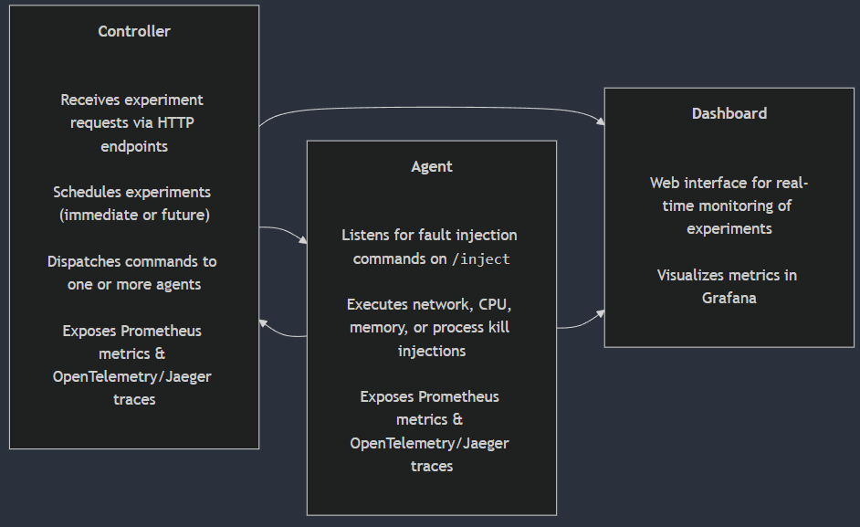

# ChaosLabs: A Chaos Engineering Toolkit

ChaosLabs is an open-source toolkit designed for chaos engineering experiments in distributed systems. With ChaosLabs you can simulate network faults, resource starvation, and process failures across multiple agents and clusters. The system comprises three main components:

- **Controller:** Orchestrates chaos experiments and dispatches fault injection commands to agents.
- **Agent:** Executes fault injection experiments (e.g., network latency, CPU stress, memory stress, process kill).
- **Dashboard:** Provides a user-friendly interface to monitor and manage experiments in real-time.

## Table of Contents
1. [Architecture](#architecture)
2. [Features](#features)
3. [Setup & Installation](#setup--installation)
4. [Usage](#usage)
5. [Observability & Monitoring](#observability--monitoring)
6. [Troubleshooting](#troubleshooting)
7. [FAQ](#faq)
8. [User Guides & Tutorials](#user-guides--tutorials)
9. [Contributing](#contributing)
10. [License](#license)

## Architecture

ChaosLabs' architecture is based on a microservices design. The components interact as follows:



- **Controller:**  
  - Receives experiment requests via HTTP endpoints.  
  - Schedules experiments (immediately or at a future time) and dispatches them to one or more agents.  
  - Exposes custom Prometheus metrics (e.g., experiment counts and durations) and distributed tracing via OpenTelemetry/Jaeger.
  
- **Agent:**  
  - Listens for fault injection commands on its `/inject` endpoint.  
  - Implements various fault injection techniques (network latency/loss via `tc`, CPU/memory stress using `stress-ng`, process kill).  
  - Exposes Prometheus metrics and distributed tracing data.
  
- **Dashboard:**  
  - Provides a web interface for monitoring experiments in real time and visualizing metrics using Grafana.
  
For detailed design diagrams and further documentation, please visit our [Wiki](https://github.com/your-username/chaoslab/wiki).

## Features

- **Fault Injection:**  
  Simulate network faults, resource exhaustion, and process failures.
  
- **Scheduling & Parallel Execution:**  
  Schedule experiments to start in the future or run them concurrently across multiple agents.
  
- **Observability:**  
  Integrated Prometheus metrics, Grafana dashboards, and distributed tracing (Jaeger/OpenTelemetry) for full visibility.
  
- **Scalability & Multi-Cluster Support:**  
  Horizontally scalable components with multi-cluster communication support.

## Setup & Installation

### Prerequisites
- [Docker](https://docs.docker.com/get-docker/)
- [Docker Compose](https://docs.docker.com/compose/install/)
- Go 1.18 or later
- Python 3.9 (for the dashboard)
- Kubernetes (Minikube, Docker Desktop, or a cloud provider)
- Prometheus & Grafana for monitoring
- Jaeger for tracing

### Local Setup

1. **Clone the Repository:**
   ```bash
   git clone https://github.com/your-username/chaoslabs.git
   cd chaoslabs

2. **Build & Run Components Locally:**

- Controller: 
   ```bash
   cd controller
   go run main.go

- Agent: 
   ```bash
   cd agent
   go run main.go

- Dashboard: 
   ```bash
   cd dashboard
   python app.py

3. **Access the Dashboard:** Open your browser at http://localhost:5500.

## 3 Local Setup
Please refer to the Kubernetes Documentation for detailed instructions on deploying ChaosLabs using the provided manifests.

## Usage
### Running an Experiment
Send a POST request to the controller’s `/start` endpoint. For example, to run a CPU stress test:
   ```bash
curl -X POST -H "Content-Type: application/json" -d '{
    "name": "CPU Stress Test",
    "description": "Runs CPU stress with 4 workers for 15s",
    "experiment_type": "cpu-stress",
    "duration": 15,
    "cpu_workers": 4
}' http://localhost:8080/start
```

Other available experiment types:

- **Network Latency:** `"experiment_type": "network-latency", "delay_ms": 100`
- **Network Packet Loss:** `"experiment_type": "network-loss", "loss_percent": 10`
- **Memory Stress:** `"experiment_type": "mem-stress", "mem_size_mb": 200`
- **Process Kill:** `"experiment_type": "process-kill", "kill_process": "go"`

### Scheduling & Parallel Experiments
Include a `start_time` (in RFC3339 format) to schedule an experiment, or set `"parallel": true` and specify `"agent_count"` to run on multiple agents concurrently.

## Observability & Monitoring
- **Prometheus Integration:** Both the controller and agent expose /metrics endpoints with custom metrics. Prometheus is configured to scrape these endpoints via annotations in the Kubernetes manifests.
- **Grafana Dashboards:** Import the provided Grafana dashboard JSON into Grafana to visualize experiment counts, durations, agent health, and resource utilization.
- **Distributed Tracing:** Integrated with Jaeger/OpenTelemetry for end-to-end tracing. Adjust the Jaeger collector endpoint as needed.

## Troubleshooting
### Common Issues
- **Image Pull Errors:** Verify that your Docker images are correctly tagged and accessible in your container registry.
- **Fault Injection Failures:** Some fault injection techniques require privileged access. Ensure your agent container is running with the necessary privileges.
- **Metrics Not Scraped:** Confirm that the Prometheus annotations in your Kubernetes manifests are correctly set.
- **Tracing Issues:** Check that the Jaeger collector endpoint is reachable and properly configured.

For more details, see the Troubleshooting Guide.

## FAQ
**Q: Do I need root privileges to run ChaosLabs?**
A: Yes, some fault injection methods (e.g., using `tc netem` and `stress-ng`) require root or privileged container access.

**Q: Can I run ChaosLabs on my local machine?**
A: Absolutely! You can run all components locally via Docker Compose or individually using the provided scripts.

**Q: How can I contribute new fault injection methods?**
A: Please see our Contributing Guidelines for details.

## User Guides & Tutorials
For step-by-step tutorials on running chaos experiments (e.g., CPU stress test, network partition simulation), please refer to the User Guide.

## Contributing
We welcome community contributions! See Contributing Guidelines for more information on how to submit issues, feature requests, and pull requests.

## License
ChaosLabs is licensed under the MIT License. See LICENSE for details.
